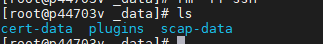
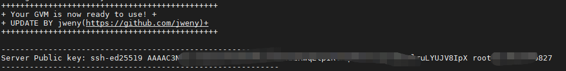
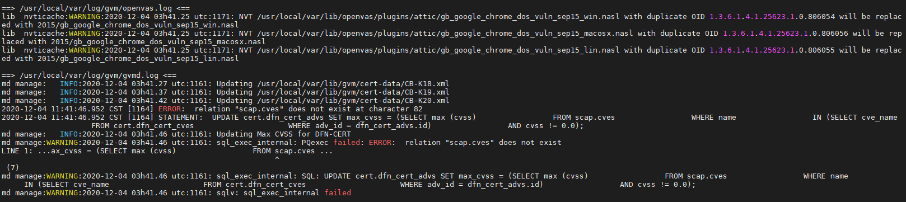
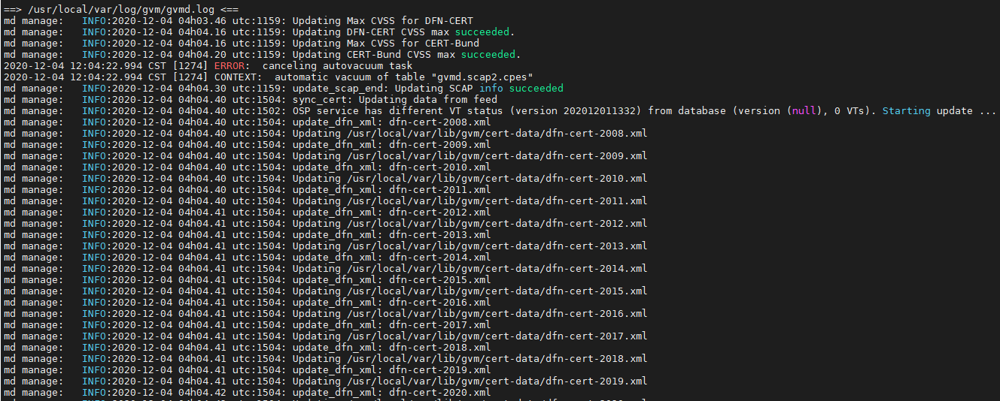
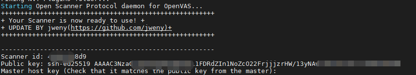
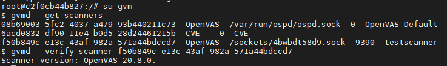
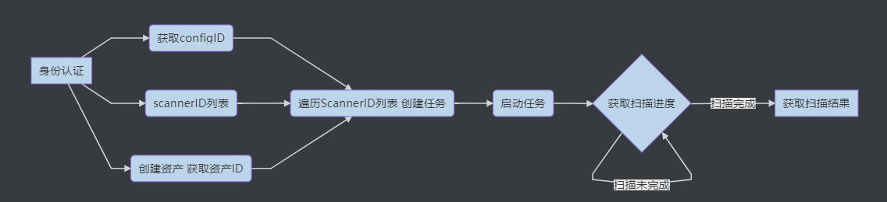

# Distributed_Docker_OpenVAS
基于Docker集群的分布式Openvas(GVM)。

## 0x01 主要实现

1. NVT、SCAP、CERT规则库打包（20201126）
2. 最新版 GVM Docker镜像（v20.8.0）
3. 最新版 GVM Scanner Docker镜像（v20.8.0）
4. 单GVM - 多Scanner 分布式部署
5. 与其他工具集成，远程调度。

## 0x02 规则库

NVT、SCAP、CERT规则库(20201126)链接：

https://pan.baidu.com/s/1Au_xKGV6Fwb3FmT-62QbwA  密码:nja5

## 0x03 分布式部署

### GVM部署

测试环境:192.168.102.137	CentOS7

**准备工作**

1. [docker禁用ipv6](https://github.com/lanlin/notes/issues/80)。

2. [先下载项目中规则库](https://github.com/jweny/Distributed_Docker_Openvas)。plugins为NVT规则，cert-data为CERT规则，scap-data为SCAP规则。将三个文件夹copy至宿主机的 `/var/lib/docker/volumu/gvm-data/_data/` 下。

   

**构建镜像**

```shell
# 自建镜像
git clone https://github.com/jweny/Distributed_Docker_Openvas.git
cd gvm-docker-20.08
docker build -t jweny/gvm-docker-20.08 .

# 也可以直接使用打包好的镜像

docker pull jweny/gvm-docker-20.08
```

**启动镜像**

| 参数           | 含义            | 默认值                                           |
| -------------- | --------------- | ------------------------------------------------ |
| -e USERNAME    | 用户名          | admin                                            |
| -e PASSWORD    | 密码            | admin                                            |
| -e DB_PASSWORD | PostgreSql 密码 | 随机生成，用户名gvm                              |
| -e HTTPS       | 是否启用https   | true                                             |
| -e SSHD        | 是否启用ssh     | 如果启用远程扫描器必须将其置为true 默认值：false |
| -e TZ          | 时区            | UTC                                              |

```shell
# 后面要部署多个scanner 这里SSHD必须设置为true
docker run -d -p 2222:22 -p 5432:5432 -p 9392:9392 -p 6379:6379 -p 9390:9390 -e TZ="Asia/Shanghai" -e SSHD="true" -e DB_PASSWORD="dbpassword" -e PASSWORD="strongpassword" --volume gvm-data:/data --name gvm jweny/gvm-docker-20.08

docker start gvm
```

检查是否启动成功：

```
docker logs -f gvm
```

如果看到下图则启动成功：



这个报错忽略。产生原因是没有启动gvm服务前创建scap。gvm启动后会自动从scap文件中加载。





启动后，容器端口使用情况如下。GVM宿主机防火墙请允许

远程Scanner访问映射后的端口(9392、9390、2222)。此时即可访问web界面`https://192.168.102.137:9392/`，当查看web端的规则库时提示`没有SCAP数据库`的错误时不用担心，因为初次启动时GVM服务端将解析规则库文件并创建数据库，该过程需要几分钟时间。

| 服务名称   | 端口 |
| ---------- | ---- |
| web        | 9392 |
| ssh        | 22   |
| postgresql | 5432 |
| redis      | 6379 |
| gmp server | 9390 |

### Scanner部署

测试环境:192.168.102.138	CentOS7

**准备工作**

将下载好的plugins文件夹copy至宿主机`/var/lib/docker/volumu/scanner/_data/`。 

**构建镜像**

```shell
# 自建镜像
git clone https://github.com/jweny/Distributed_Docker_Openvas.git
cd scanner-docker-20.08
docker build -t jweny/gvm-scanner-docker-20.08 .

# 使用打包好的镜像
docker pull jweny/gvm-scanner-docker-20.08:lastest
```

**启动镜像**

| 参数              | 含义         |
| ----------------- | ------------ |
| -e MASTER_ADDRESS | GVM IP/域名  |
| -e MASTER_PORT    | GVM ssh 端口 |

```shell
docker run -d --volume scanner:/data -e MASTER_ADDRESS=192.168.102.137 -e MASTER_PORT=2222 --name scanner jweny/gvm-scanner-docker-20.08
docker start scanner
```

检查是否启动成功：

```
docker logs -f scanner
```

如果看到下图则启动成功：



**GVM中注册Scanner**

记录上一步中的 `Scanner id` 和 `Public key`，然后GVM中注册Scanner（添加Scanner公钥）。

```
docker exec -it gvm /add-scanner.sh
输入：
	scanner Name：Scanner名称，任意命名
	scanner id
	scanner 公钥
```

**检测Scanner是否注册成功的方法**

进入 gvm 容器，切换至 gvm 用户，获取Scanner列表。确认新增的Scanner是否正常连接，如果返回Scanner版本说明没有异常。



## 0x04 调度Demo



注意：单个扫描任务创建时要分配Scanner且无法修改，这个是比较大的缺陷，想要修改只能删除重新创建。一种最基础的轮询策略，在创建任务时，将任务平均分配到每一个scanner。

**身份认证**

```go
gmpClient, err := gvmClient("192.168.102.137:9390", "admin", "strongpassword")
```

**获取configID**

​	使用Demo前要在前端自建一个config，可以根据config的名称获取其ID：

```go
//提前在前端创建好要扫描的规则  根据规则名称获取 规则id
configId, err := getConfigId(gmpClient, "system_config")
```

**获取scannerID列表**

```go
scannerList, err := getScannersIdList(gmpClient)
```

​	值得注意的是，GVM自带一个CVE Scanner，如果只使用config扫描的话，分配任务时需要CVE Scanner的ID从scannerID列表中删除。

**创建新资产**

​	方式一：使用GVM自带的端口列表（传入默认端口的id）

```go
assetsId, err := createAssetsFromExistPort(gmpClient,"测试域名-Ping存活", "localhost","4a4717fe-57d2-11e1-9a26-406186ea4fc5")
```

​	方式二：自定义扫描的端口范围

```go
assetsId,err := createAssetsFromNewPort(gmpClient,"自定义端口", "localhost","T:7120,7106,7103,7117,7110,139,7102,80,7104,7100,3306,445,22")
```

**创建任务**

```
taskId, err := createTask(gmpClient, "测试任务", configId, assetsId, scannerId)
```

**启动任务**

```
success, err := startTask(gmpClient, taskId)
```

**获取结果**

​	获取所有任务结果：

	getAllResult(gmpClient)
​	获取单个任务的结果：

```go
for {
		// 循环获取任务进度 status == "-1"代表完成
		// 任务进行中 status为 1-99 代表扫描进度的百分比
		status, _ := getTaskProcess(gmpClient,taskId)
		time.Sleep(10 * time.Second)
		if status == "-1"{
			// 获取单个任务的结果
			getSingleTaskResult(gmpClient, taskId)
			break
		}
	}
}
```

